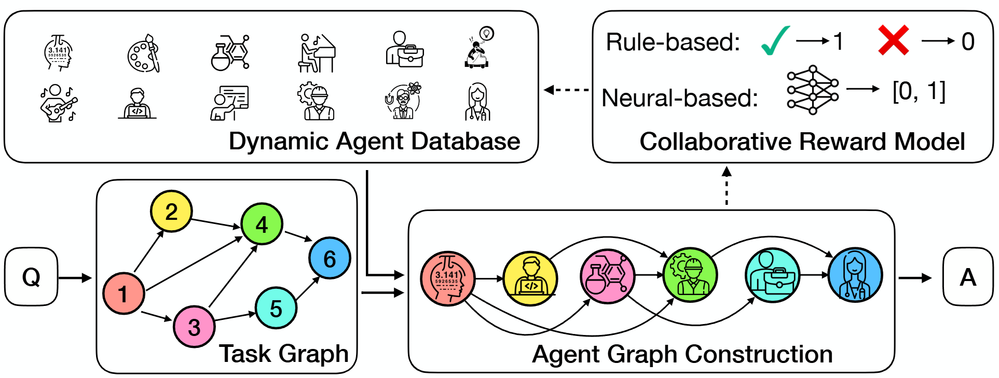
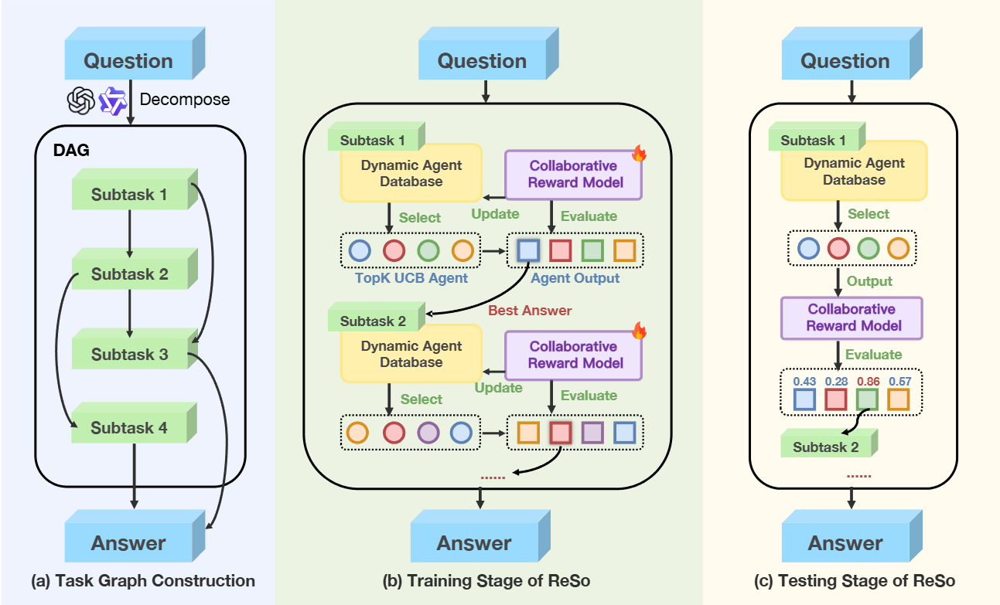
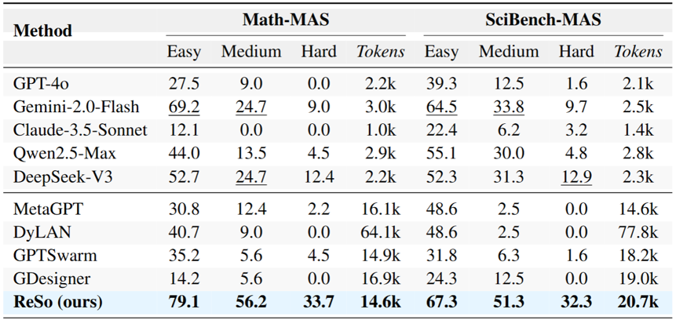

<div align="center">

# ReSo: A Reward-driven Self-organizing LLM-based Multi-Agent System for Reasoning Tasks

[](https://arxiv.org/abs/2503.02390)
[](https://huggingface.co/henggg/ReSo/tree/main)
[](https://huggingface.co/datasets/henggg/ReSo-MAS)

</div>

<div align="center" style="font-family: Arial, sans-serif;">
  <p>
    <a href="#news" style="text-decoration: none; font-weight: bold;">🎉 News</a> •
    <a href="#introduction" style="text-decoration: none; font-weight: bold;">📖 Introduction</a> •
    <a href="#main-results" style="text-decoration: none; font-weight: bold;">📊 Main Results</a>
  </p>
  <p>
    <a href="#getting-started" style="text-decoration: none; font-weight: bold;">✨ Getting Started</a> •
    <a href="#usage" style="text-decoration: none; font-weight: bold;">🎯 Usage</a> •
    <a href="#data-generation" style="text-decoration: none; font-weight: bold;">📊 Data Generation</a> •
    <a href="#pre-trained-models" style="text-decoration: none; font-weight: bold;">🤖 Models</a> •
    <a href="#development" style="text-decoration: none; font-weight: bold;">🛠️ Development</a> •
    <a href="#contact" style="text-decoration: none; font-weight: bold;">📨 Contact</a> •
    <a href="#citation" style="text-decoration: none; font-weight: bold;">🎈 Citation</a>
  </p>
</div>

---

# 🎉 News

- [2025-08-21] ReSo has been accepted to EMNLP 2025! See you in Suzhou in November.


# 📖 Introduction

ReSo is a comprehensive framework for multi-step mathematical and scientific reasoning. It combines a self-organizing multi-agent architecture with reward-driven optimization to plan, solve, and refine solutions iteratively.

<p align="center">
  
</p>

Key capabilities:
- Agent graph for task decomposition and collaboration
- Reward modeling for iterative self-optimization
- Modular LLM backends and configurable pipelines

<p align="center">
  
</p>

# 📊 Main Results

ReSo achieves competitive performance on math and science reasoning benchmarks. See examples below and refer to the paper for full details.

<p align="center">
  
</p>

# ✨ Getting Started

## Prerequisites

- Python 3.10+
- CUDA-compatible GPU (recommended)
- Git

## Installation

1) Clone the repository

```bash
git clone <repository-url>
cd ReSo/
```

2) Create and activate environment

```bash
conda create -n ReSo python=3.10 -y
conda activate ReSo
pip install -r requirements.txt
```

3) Configure API keys (optional, if using external LLMs)

Create and edit your environment file:

```bash
cp .env.template .env
```

Fill `.env` with your credentials:

```bash
# OpenAI
OAI_API_KEY=your_openai_api_key
OAI_BASE_URL=https://api.openai.com/v1

# Qwen
QWEN_API_KEY=your_qwen_api_key
QWEN_BASE_URL=your_qwen_base_url

# Claude
CLAUDE_API_KEY=your_claude_api_key
CLAUDE_BASE_URL=your_claude_base_url

# Gemini
GEMINI_API_KEY=your_gemini_api_key
GEMINI_BASE_URL=your_gemini_base_url

# DeepSeek
DEEPSEEK_API_KEY=your_deepseek_api_key
DEEPSEEK_BASE_URL=your_deepseek_base_url
```

## Project Structure

```
ReSo/
├── ReSo/                    # Core framework modules
│   ├── agent_graph/         # Agent graph implementation
│   ├── llm_agent/           # LLM agent components
│   ├── model/               # Custom model implementations
│   └── task_graph/          # Task graph management
├── datasets/                # Data synthesis and storage
│   ├── data_gen.py          # Complex problem generator
│   ├── get_answer.py        # Answer extraction utilities
│   ├── sub_question/        # Base sub-question datasets
│   ├── MATH-MAS/            # MATH MAS datasets
│   └── Scibench-MAS/        # Science benchmark datasets
├── experiments/             # Training and evaluation scripts
├── reward_model/            # Reward model training & usage
├── config.ini               # Model & agent configuration
├── config_hyper.ini         # Training hyperparameters
└── requirements.txt         # Python dependencies
```

# 🎯 Usage

## Training

Train on your dataset:

```bash
python experiments/train_ReSo.py --dataset_path <path_to_training_data>
```

Notes:
- Configure training hyperparameters in `config_hyper.ini`.
- Adjust model/agent settings in `config.ini`.

## Evaluation

MATH-MAS benchmarks:

```bash
# Easy
python experiments/test_ReSo.py --dataset_path datasets/MATH-MAS/MATH-MAS-Easy.json --plan_mode gt

# Medium
python experiments/test_ReSo.py --dataset_path datasets/MATH-MAS/MATH-MAS-Medium.json --plan_mode gt

# Hard
python experiments/test_ReSo.py --dataset_path datasets/MATH-MAS/MATH-MAS-Hard.json --plan_mode gt
```

GSM8K:

```bash
python experiments/test_gsm8k.py --dataset_path <gsm8k_dataset_path>
```

Common flags:
- `--dataset_path`: Path to dataset file
- `--plan_mode`: Planning mode (`gt` for ground truth)
- `--random_select`: Randomized selection (optional)
- `--error_tolerance`: Error threshold (optional)

# 📊 Data Generation

Create complex multi-step problems using the generator.

### 1) Prepare base sub-questions

Location: `datasets/sub_question/`
- `math_test.json` (math)
- `scibench.json` (science)

Each entry contains a prompt, answer, variables, and metadata.

### 2) Generate complex problems

```bash
python datasets/data_gen.py -n <num_questions> -c <complexity_level> [-o <output_file>]
```

Examples:

```bash
# 100 questions, 3 sub-questions
python datasets/data_gen.py -n 100 -c 3

# 50 questions, 5 sub-questions, custom output
python datasets/data_gen.py -n 50 -c 5 -o datasets/mixed/complex_dataset.json
```

### 3) How it works

1. DAG construction for dependency structure
2. Linking sub-questions via variables/answers
3. Integration into a final composite task
4. Validation for consistency and solvability

See `datasets/README.md` for details.

# 🤖 Pre-trained Models

We provide fine-tuned models on Hugging Face:
- Plan model for multi-step planning
- CRM (Critic-Reward Model) for evaluation and optimization

Browse: https://huggingface.co/henggg/ReSo/tree/main

# 🔬 Key Features

## Multi-Agent Reasoning
- Agent graph for structured collaboration
- Automatic task decomposition
- Coordinated solving across agents

## Self-Optimization
- Reward modeling for quality assessment
- Iterative refinement and error detection
- Supports custom reward models

## Flexible Architecture
- Modular design for new models/strategies
- Multiple LLM providers (OpenAI, Claude, Gemini, Qwen, DeepSeek, etc.)
- Configurable pipelines and behaviors

# 📈 Performance

ReSo shows strong performance on MATH, GSM8K, and science benchmarks. Refer to the paper for full metrics.

# 🛠️ Development

## Add a new model
1. Implement interface in `ReSo/llm_agent/`
2. Add options in `config.ini`
3. Register in `ReSo/llm_agent/model_info.py`

## Custom reward models
1. Define architecture in `ReSo/model/`
2. Implement training in `reward_model/train.py`
3. Add evaluation in `reward_model/test.py`

## Extend data generation
1. Add formats in `datasets/sub_question/`
2. Update logic in `datasets/data_gen.py`
3. Update parsing in `datasets/get_answer.py`

# 🤝 Contributing

Issues and PRs are welcome. Please follow standard code style, add tests when changing behavior, and update docs when relevant.

# 📨 Contact

- Open an issue on GitHub
- Email: zhouheng@pjlab.org.cn

# 🎈 Citation

If you find ReSo helpful, please cite our paper:

```bibtex
@article{zhou2025reso,
  title={ReSo: A reward-driven self-organizing llm-based multi-agent system for reasoning tasks},
  author={Zhou, Heng and Geng, Hejia and Xue, Xiangyuan and Kang, Li and Qin, Yiran and Wang, Zhiyong and Yin, Zhenfei and Bai, Lei},
  journal={arXiv preprint arXiv:2503.02390},
  year={2025}
}
```